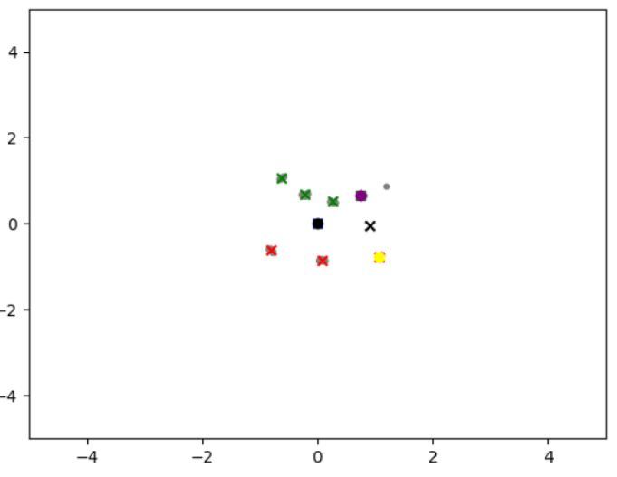

# High-Speed Mobile Unmanned Vehicles Based on ROS Architecture

> This project won the national first prize in the Undergraduate Intelligent Vehicle Competition🥳🥳🥳😶‍🌫️😶‍🌫️😶‍🌫️
>
> Team members:   🥳Zheng @ [bsgbsg7](https://github.com/bsgbsg7)   🥳Yuxin @ [CYXYZ (CSir)](https://github.com/CYXYZ)  🥳Yuan @ [vegetabledogzy](https://github.com/vegetabledogzy)  🥳Liding

## System Overview

1. - [x] Utilize radar data and machine learning algorithms for precision cone bucket positioning
1. - [x] Visual perception: traffic light, stop sign and cone barrel detection
3. - [x] Research on intelligent vehicle cruise system and adaptive anti-disturbance control strategy based on cone barrel positioning
4. - [x] Research on mapping and positioning of intelligent vehicle at high speed
5. - [x] Research on navigation automatic driving based on existing maps and multi-sensor information fusion

## Radar data preprocessing and clustering with machine learning algorithms

## Traditional CV and Deep Learning to identify special track elements

## Look-ahead point determination with vehicle cruise control

## 2D lidar mapping in high-speed moving environment

## Dynamic obstacle avoidance and navigation based on existing maps

## Video

